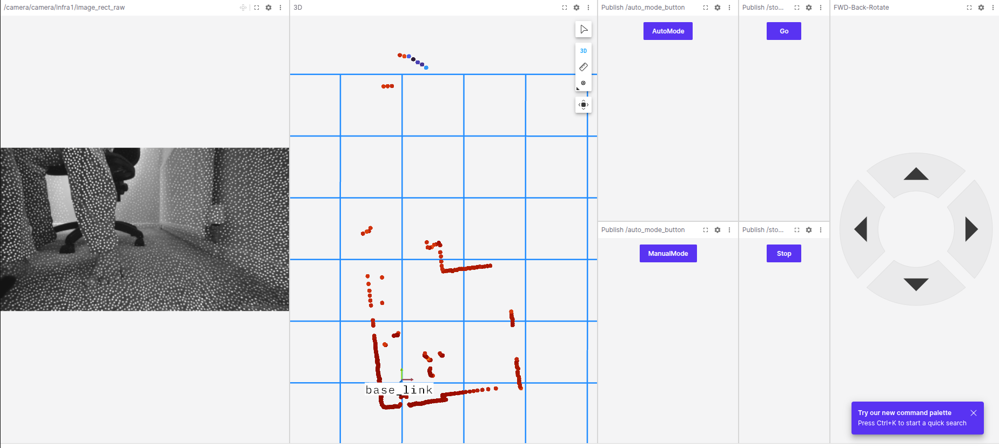

# Jetcar Project

## Overview
Jetcar is a 4-wheel differential drive robot system using Jetson Orin Nano and an MCU(Pi Pico W RP2040 or ESP32S3-Pico). It uses a Realsense 435 camera, LD06 lidar and other sensor data for autonomous navigation and object search, controlled via a web interface. It uses ROS2 Humble.



## Use Cases: 
when the user asks to navigate to the red football, it scans the room by spinning the body, until the object is found. It then navigates to the ball around obstacles and stops at a safe distance. If the path is below a chair, it should intelligently see the height and go below or around. 

## What Works 
5-Mar-2026: Teleoperation using Foxglove GUI works. Gathering VSLAM data using ISAAC ROS and 2D lidar data using LD06 library works. 
31-May-2026: Teleop using foxglove works in both sim mode as well as real_robot mode. nav2 navigation also causes displacement, just not in the expected trajectory. CPU util for jetson is now down to 65% in both sim and real robot case. GPU still zero., and this is to be fixed in forthcoming changes.network traffic is high at 100+ MB/s due to video feed. Can only be managed via ethernet. /camera topic rate is measly at 6.5fps in sim mode, with massive variation of 0.03sec to 1.34 sec per frame.
## and what's next
see `docs/training_plan.md`
## Learning Objectives
-Learn use of FreeRTOS or Zephyr on Pi Pico, with concurrent processes on both cores.
-Learn considerations for safe use of C++ code and aligning as close as possible to MISRA concepts. Use non-blocking, deterministic code.
-Learn to configure a robot in ROS2 Humble. 
-Learn to apply LLM/VLM for mobile robots. 
-Learn to test unit/integration/system level using test frameworks and Isaac Sim, without having to actually drive the robot
-Learn to apply industrial functional safety standards and cybersecurity standard(IEC62443) to this robot

## Hardware 
**Jetson Orin Nano 8GB**: runs ROS2 nodes, web server, connects to MCU via USB-UART, reads Realsense D435 camera, reads LD06 Lidar via USB-UART. USB-UART is via CP2104 adapters. Comm between MCU and Jetson uses mavlink protocol.
**MCU = Raspberry Pi Pico W or ESP32S3-Pico**: Controls motors, reads cliff sensors, front and rear sonar, IMU 6050 and wheel encoders.It can override motor commands to prevent collision and it will stop motors in case Jetson commands are timed out.
**Sensors**: The sensors it has are : front - realsense D435 depth camera via USB, LD2450 human tracking lidar. Front and Rear: HC-SR04 sonar. On body:  MPU6050 acceleration sensor and LD06 lidar. 
**Actuators**: 4x 370 type DC brushed motors with encoders. gear ratio 46, pulses per rev 11, hall encoder with forward and reverse sensor pickups. Waveshare Pico motor driver to drive 4 motors.

## Quick Start
1. install dependencies
see scripts/setup-env.sh
Can be dockerised in future
2. **Clone the repo**
see scripts/setup-repo.sh

3.**Use this pacakge for bringup**  `src/jetcar_bringup/`
  **Develop ROS2 python nodes for Rpi5/Jetson in** `src/python_pkg/`
  **Develop ROS2 C++ nodes for Jetson in** `src/jetcar_real/`
  **Develop ROS2 nodes for PC simulation in** `src/jetcar_sim/`
  **Manage navigation parameters and logic in** `src/jetcar_nav`
  **Manage the robot URDF in** `src/jetcar_description/`
  **Develop Pi Pico W code in** `src/mcu/pico-PlatformIO/`
  **Develop ESP32S3-Pico code in** `src/mcu/esp32-PlatformIO/`
  **Common microcontroller library files** `src/mcu/include/`
  **Define custom ROS messages in** `src/robot_msgs/msg/` and build with `colcon build`
  **Access foxglove visualisation** `ws://192.168.50.177:8765` or your chosen IP address. configure this in the foxglove node. You can use docs/jetcar-foxglove-layout.json in foxglove as a layout import
  **Define pins for MCU in** `libs/arduino/RobotCarPinDefinitionsAndMore.h`
  **Define robot urdf** in `src/jetcar_real/urdf`

4. **To launch the real robot**
At prompt, enter 
```bash
USERNAME="xyz" # CHANGE THIS to your computer's username
REPO_DIR="/home/$USERNAME/Jetcar"
cd $REPO_DIR

source install/setup.bash
ros2 launch jetcar_bringup real_robot.launch.py
```

5. **To launch the distributed simulation**
For a distributed setup (Gazebo physics on PC, Nav2/HMI on Jetson):
**On PC:**
```bash
source install/setup.bash
ros2 launch jetcar_sim pc_gazebo.launch.py
```
**On Jetson Orin Nano:**
```bash
source install/setup.bash
ros2 launch jetcar_bringup jetson_sim_nav.launch.py
```

## Diagrams
See `docs/designs/wiring/wiring-withEsp32.fzz` for wiring layouts. 
See `docs/designs/architecture.md` for system and software architecture diagrams (Mermaid format). TODO: Needs update for ROS2 node diagram considering Isaac

## Next Steps
**MCU**
- TODO: Interlocks to ensure MCU stops robot at least 100mm from an obstacle to prevent collision. Also avoids falling down cliff.

**Jetson**
- TODO: Implement sensor fusion and navigation logic in ROS2 nodes


---
### Docker Build/Run Instructions

For building docker for Pi5:
```
docker build -f docker/Dockerfile -t picowcar-pi5 --build-arg ENV=pi5 .
```

To build docker for dev env:
```
docker build -f docker/Dockerfile -t picowcar-dev --build-arg ENV=dev .
```

After building your Docker container for development, you can use it as follows:

#### 1. Run the Container Interactively
```
docker run -it --rm \
  --name picowcar-dev \
  -v $(pwd)/pc-src:/app/pc-src \
  -v $(pwd)/config:/app/config \
  -v $(pwd)/logs:/app/logs \
  picowcar-dev
```

#### 2. Run Your Application
If your Dockerfile’s `CMD` is set to run your app, the container will start it automatically. Otherwise, you can run commands inside the container:
```
docker exec -it picowcar-dev /bin/bash
# Then run your Python scripts or tests
```

#### 3. Use Docker Compose (Recommended for Dev)
If you have a `docker-compose.dev.yml`, start your dev environment with:
```
docker-compose -f docker/docker-compose.dev.yml up
```
This will handle volumes, ports, and environment variables for you.

---

**Summary:**  
- Use `docker run` or `docker-compose` to start your dev container.
- Mount your code as volumes for live development.
- Use `docker exec` for interactive work inside the running container.