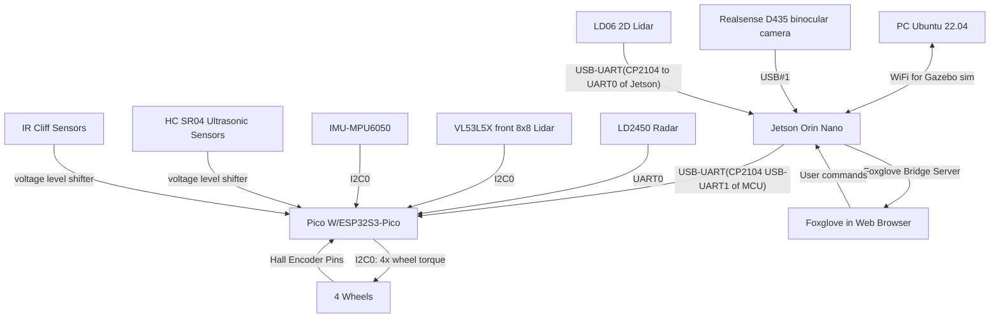
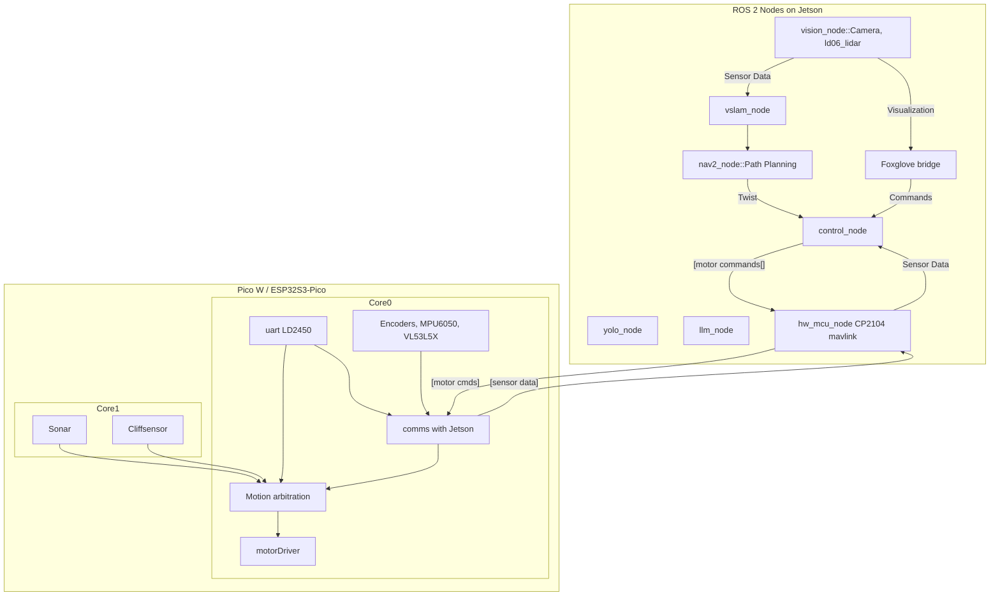
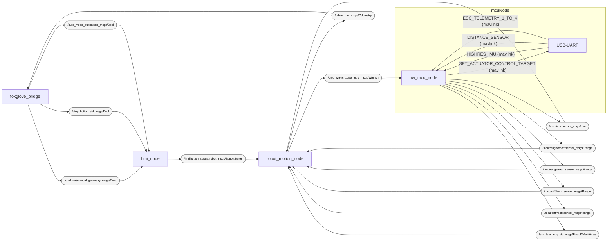
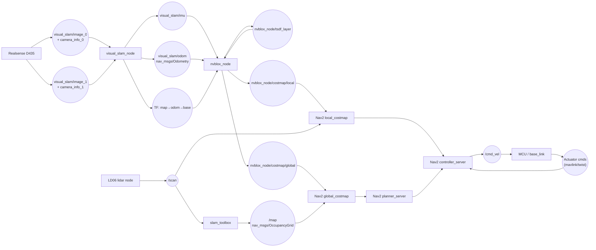

# System Architecture Diagram

# Budgets
**RAM for Jetson Orin Nano 8GB**
Current state: 1.6GB with Isaaac, Ld06, Realsense,gnome display, MCU bridge and foxglove bridge all running. Isaac 
Need to manage Yolo/other recognition framework and an llm/VLA model in remaining space. Keep 0.8GB spare at all times. 

estimates from chatgpt
Realsense
depth resolution: 640×480
fps: 15
decimation filter ON
pointcloud OFF
Saves 200–300 MB.

RTAB-Map
Mem/IncrementalMemory = true
Kp/MaxFeatures = 400
RGBD/OptimizeFromGraphEnd = true
RGBD/LinearUpdate = 0.1
Reg/Strategy = 0 (visual odom only)
RGBD/MaxRange = 4.0
Grid/FromDepth = false (use external costmap)
Saves ~1 GB.

Nav2
reduce global costmap resolution to 0.1 or 0.12 m
Voxel layer:
max_z = robot_height + 10 cm
z_voxels = 8–12
Use only local 3D info if possible
Saves ~150 MB.

⭐ Recommended “safe mode” loadout
If you want reliability and smooth operation:

Run these simultaneously:
Realsense depth 640×480 @ 15 fps
RTAB-Map tuned
Nav2 costmap (voxel layer on)
RPLidar
Foxglove bridge

Avoid:
Running YOLO inference constantly on CPU
Storing large pointcloud histories
Uncompressed rear camera streams
This mode runs in 3.8–4.5 GB comfortably.
**Timing for Jetson Orin Nano**
**timing for ESP32S3-Pico**
Core0
Core1

# Software Architecture Diagram

# Node + Topic Graph

# Navigation 

