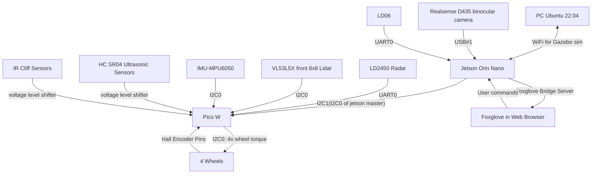
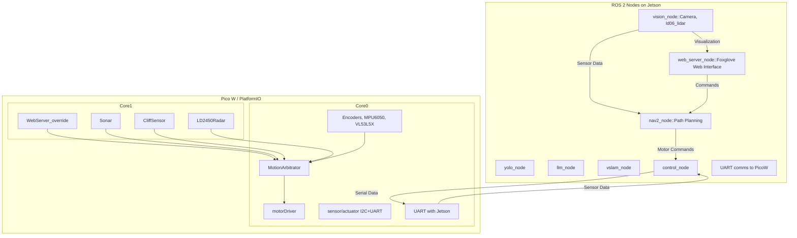
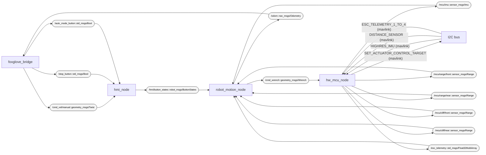

# System Architecture Diagram

```mermaid
graph TD
    PC[PC Ubuntu 22.04] <-- WiFi for Gazebo sim--> Jetson[Jetson Orin Nano]
    Jetson -- I2C1(I2C0 of jetson master) --> PicoW[Pico W]
    Realsense[Realsense D435 binocular camera] -- USB#1 --> Jetson
    PicoW -- I2C0: 4x wheel torque --> PCA9685_AWDDriver[4 Wheels]
    PCA9685_AWDDriver[4 Wheels] -- Hall Encoder Pins --> PicoW
    Jetson -- Foxglove Bridge Server --> Web[Foxglove in Web Browser]
    Web[Foxglove in Web Browser] --User commands--> Jetson
    Radar[LD2450 Radar] -- UART0 --> PicoW
    Lidar2D[LD06] -- UART0 --> Jetson
    Lidar[VL53L5X front 8x8 Lidar] -- I2C0 --> PicoW
    IMU[IMU-MPU6050] -- I2C0 --> PicoW
    USensors[HC SR04 Ultrasonic Sensors] -- voltage level shifter --> PicoW
    IRSensors[IR Cliff Sensors] -- voltage level shifter --> PicoW
```

# Software Architecture Diagram

```mermaid
flowchart TD
    subgraph ROS2Nodes[ROS 2 Nodes on Jetson]
        Vision[vision_node::Camera, ld06_lidar]
        Recognition[yolo_node]
        LLM[llm_node]
        SLAM[vslam_node]
        Navigation[nav2_node::Path Planning]
        Control[control_node]
        Comms[UART comms to PicoW]
        WebServer[web_server_node::Foxglove Web Interface]
    end
    subgraph PicoW_Arduino[Pico W / PlatformIO]
        subgraph Core0
            MotionArbitrator
            PicoWMotors[motorDriver]
            PicoWComms[sensor/actuator I2C+UART]
            PicoWSerial[UART with Jetson]
            PicoWSensors[Encoders, MPU6050, VL53L5X]
        end
        subgraph Core1
            WebServer_override
            Sonar
            CliffSensor
            LD2450Radar
        end
    end
    Vision -- Sensor Data --> Navigation
    Navigation -- Motor Commands --> Control
    Control -- Serial Data --> PicoWSerial
    PicoWSerial -- Sensor Data --> Control
    WebServer -- Commands --> Navigation
    Vision -- Visualization --> WebServer
    WebServer_override --> MotionArbitrator
    Sonar --> MotionArbitrator
    CliffSensor --> MotionArbitrator
    LD2450Radar --> MotionArbitrator
    PicoWSensors --> MotionArbitrator
    MotionArbitrator --> PicoWMotors
```

# Node + Topic Graph

```mermaid
graph LR
    classDef topic fill:#f5f5f5,stroke:#808080,stroke-width:1px,color:#000,font-size:11px;

    Foxglove[foxglove_bridge]
    HMI[hmi_node]
    robot_motion_node[robot_motion_node]
    MCUNode[hw_mcu_node]
    MCU_I2C[I2C bus]

    topic_cmd_vel_manual(["/cmd_vel/manual::geometry_msgs/Twist"])
    topic_stop_button(["/stop_button::std_msgs/Bool"])
    topic_auto_mode(["/auto_mode_button::std_msgs/Bool"])
    topic_button_states(["/hmi/button_states::robot_msgs/ButtonStates"])
    topic_cmd_wrench(["/cmd_wrench::geometry_msgs/Wrench"])
    topic_imu(["/mcu/imu::sensor_msgs/Imu"])
    topic_range_front(["/mcu/range/front::sensor_msgs/Range"])
    topic_range_rear(["/mcu/range/rear::sensor_msgs/Range"])
    topic_cliff_front(["/mcu/cliff/front::sensor_msgs/Range"])
    topic_cliff_rear(["/mcu/cliff/rear::sensor_msgs/Range"])
    topic_esc(["/esc_telemetry::std_msgs/Float32MultiArray"])
    topic_odom(["/odom::nav_msgs/Odometry"])

    Foxglove --> topic_cmd_vel_manual
    topic_cmd_vel_manual --> HMI
    Foxglove --> topic_stop_button
    topic_stop_button --> HMI
    Foxglove --> topic_auto_mode
    topic_auto_mode --> HMI
    HMI --> topic_button_states
    topic_button_states --> robot_motion_node
    robot_motion_node --> topic_cmd_wrench
    topic_cmd_wrench --> MCUNode

    MCUNode -- SET_ACTUATOR_CONTROL_TARGET (mavlink) --> MCU_I2C
    MCU_I2C -- HIGHRES_IMU (mavlink) --> MCUNode
    MCU_I2C -- DISTANCE_SENSOR (mavlink) --> MCUNode
    MCU_I2C -- ESC_TELEMETRY_1_TO_4 (mavlink) --> MCUNode

    MCUNode --> topic_imu
    topic_imu --> robot_motion_node
    MCUNode --> topic_range_front
    topic_range_front --> robot_motion_node
    MCUNode --> topic_range_rear
    topic_range_rear --> robot_motion_node
    MCUNode --> topic_cliff_front
    topic_cliff_front --> robot_motion_node
    MCUNode --> topic_cliff_rear
    topic_cliff_rear --> robot_motion_node
    MCUNode --> topic_esc
    topic_esc --> robot_motion_node

    robot_motion_node --> topic_odom
    topic_odom --> Foxglove

    class topic_cmd_vel_manual,topic_stop_button,topic_auto_mode,topic_button_states,topic_cmd_wrench topic;
    class topic_imu,topic_range_front,topic_range_rear,topic_cliff_front,topic_cliff_rear,topic_esc,topic_odom topic;
```
