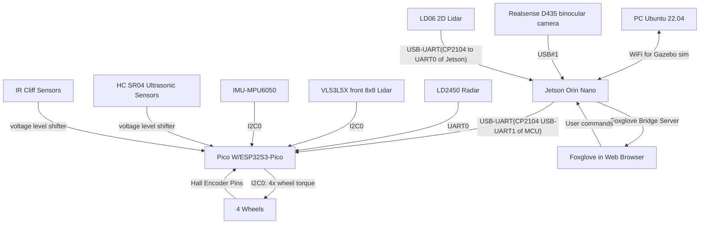
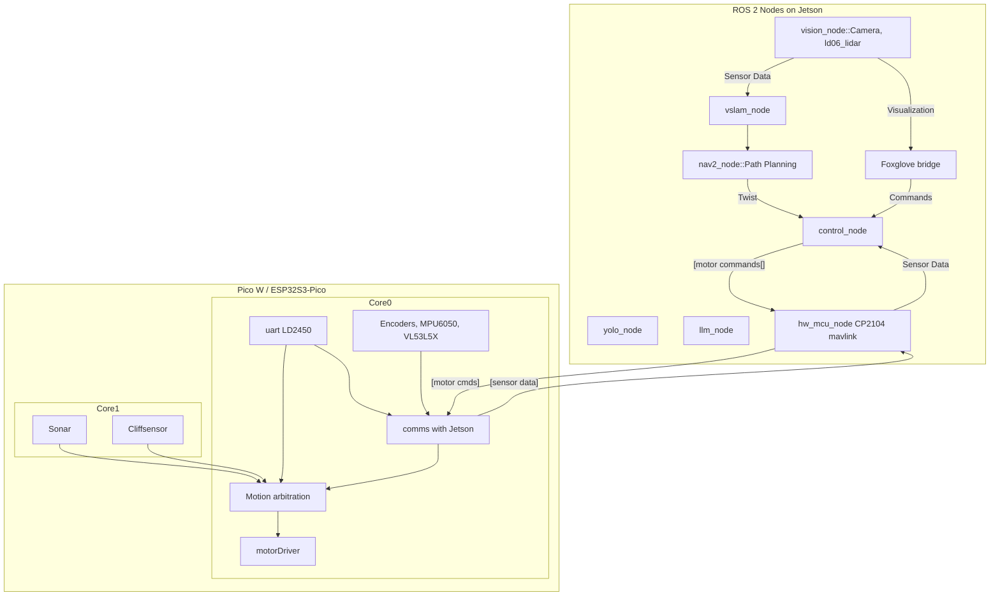
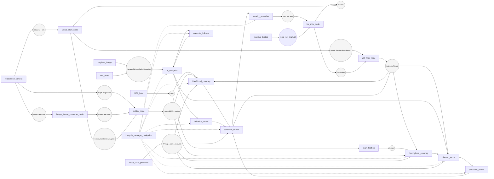

# System Architecture Diagram

# Budgets
**RAM for Jetson Orin Nano 8GB**
Current state: 1.6GB with Isaaac, Ld06, Realsense,gnome display, MCU bridge and foxglove bridge all running. Isaac 
Need to manage Yolo/other recognition framework and an llm/VLA model in remaining space. Keep 0.8GB spare at all times. 

estimates from chatgpt
Realsense
depth resolution: 640×480
fps: 15
decimation filter ON
pointcloud OFF
Saves 200–300 MB.

RTAB-Map
Mem/IncrementalMemory = true
Kp/MaxFeatures = 400
RGBD/OptimizeFromGraphEnd = true
RGBD/LinearUpdate = 0.1
Reg/Strategy = 0 (visual odom only)
RGBD/MaxRange = 4.0
Grid/FromDepth = false (use external costmap)
Saves ~1 GB.

Nav2
reduce global costmap resolution to 0.1 or 0.12 m
Voxel layer:
max_z = robot_height + 10 cm
z_voxels = 8–12
Use only local 3D info if possible
Saves ~150 MB.

⭐ Recommended “safe mode” loadout
If you want reliability and smooth operation:

Run these simultaneously:
Realsense depth 640×480 @ 15 fps
RTAB-Map tuned
Nav2 costmap (voxel layer on)
RPLidar
Foxglove bridge


Avoid:
Running YOLO inference constantly on CPU
Storing large pointcloud histories
Uncompressed rear camera streams
This mode runs in 3.8–4.5 GB comfortably.
**Timing for Jetson Orin Nano**
**timing for ESP32S3-Pico**
Core0
Core1



# Software Architecture Diagram



# Node + Topic Graph

```mermaid
---
config:
  layout: dagre
---
graph LR
  classDef topic fill:#f5f5f5,stroke:#808080,stroke-width:1px,color:#000,font-size:11px;

  subgraph UI
    Foxglove[foxglove_bridge]
    HMI[hmi_node]
  end

  subgraph Sensors
    Camera[realsense2_camera(camera)]
    LD06[ld06_lidar]
    PWM[lidar_pwm_control]
    MCU[hw_mcu_node]
  end

  subgraph "Isaac ROS Container"
    VSLAM[visual_slam_node]
    Converter[image_format_converter_node]
    NvBlox[nvblox_node]
  end

  subgraph Localization
    EKF[ekf_filter_node]
    SlamTB[slam_toolbox]
    RSP[robot_state_publisher]
  end

  subgraph "Nav2 Stack"
    Planner[planner_server]
    Controller[controller_server]
    PathSmoother[smoother_server]
    VelSmooth[velocity_smoother]
    Behaviors[behavior_server]
    BTN[bt_navigator]
    Waypoint[waypoint_follower]
    Lifecycle[lifecycle_manager_navigation]
  end

  topicButtons(["/hmi/button_states"])
  topicGoal(["/goal_pose::geometry_msgs/PoseStamped"])
  topicInfra(("Infra stereo + info\n/camera/camera/infra{1,2}/image_rect_raw"))
  topicIMU(["/mcu/imu::sensor_msgs/Imu"])
  topicDepth(("Depth image + info\n/camera/camera/depth/image_rect_raw"))
  topicColorRaw(["/camera/camera/color/image_raw"])
  topicColorRGB(["/camera/camera/color/image_rgb"])
  topicPose(["/visual_slam/tracking/vo_pose"])
  topicOdom(["/visual_slam/tracking/odometry"])
  topicWheelOdom(["/mcu/odom::nav_msgs/Odometry"])
  topicScan(["/scan::sensor_msgs/LaserScan"])
  topicCloud(["/pointcloud2d::sensor_msgs/PointCloud2"])
  topicEKF(["/odometry/filtered::nav_msgs/Odometry"])
  topicMap(["/map::nav_msgs/OccupancyGrid"])
  topicCostLocal(("nvblox ESDF + costmaps"))
  topicTF(("TF map→odom→base_link"))
  topicCmdVel(["/cmd_vel::geometry_msgs/Twist"])

  Foxglove --> topicGoal
  HMI --> topicGoal
  topicGoal --> BTN
  HMI --> topicButtons --> Foxglove

  Camera --> topicInfra --> VSLAM
  MCU --> topicIMU --> VSLAM
  Camera --> topicDepth --> NvBlox
  Camera --> topicColorRaw --> Converter --> topicColorRGB --> NvBlox
  VSLAM --> topicPose
  topicPose --> NvBlox
  topicPose --> EKF
  VSLAM --> topicOdom --> EKF
  MCU --> topicWheelOdom --> EKF
  EKF --> topicEKF --> Planner
  topicEKF --> Controller
  NvBlox --> topicCostLocal --> Planner
  topicCostLocal --> Controller
  LD06 --> topicScan --> SlamTB
  topicScan --> Controller
  SlamTB --> topicMap --> Planner
  LD06 --> topicCloud --> Foxglove
  RSP --> topicTF
  topicTF --> Planner
  topicTF --> Controller
  topicTF --> Foxglove

  BTN --> Planner
  BTN --> Behaviors
  BTN --> Waypoint
  Planner --> PathSmoother --> Controller --> VelSmooth --> topicCmdVel --> MCU
  Lifecycle -.-> Planner
  Lifecycle -.-> Controller
  Lifecycle -.-> PathSmoother
  Lifecycle -.-> VelSmooth
  Lifecycle -.-> Behaviors
  Lifecycle -.-> BTN
  Lifecycle -.-> Waypoint
  PWM --> LD06

  class topicButtons,topicGoal,topicInfra,topicIMU,topicDepth,topicColorRaw,topicColorRGB,topicPose,topicOdom,topicWheelOdom,topicScan,topicCloud,topicEKF,topicMap,topicCostLocal,topicTF,topicCmdVel topic;
```

# Navigation 

