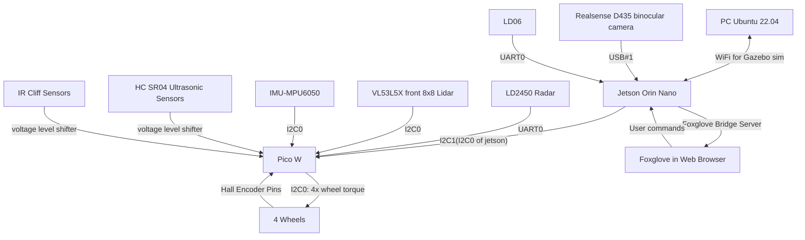
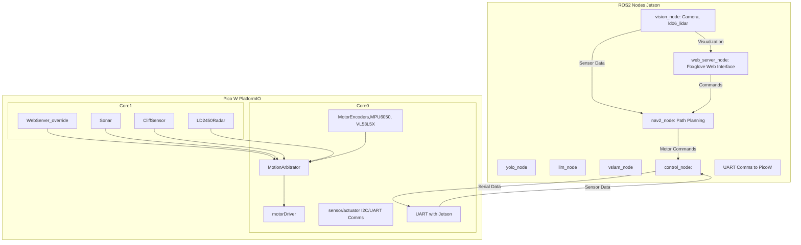

# System Architecture Diagram

```mermaid
graph TD
    PC[PC Ubuntu 22.04] <-- WiFi for Gazebo sim--> Jetson[Jetson Orin Nano]
    Jetson -- I2C1(I2C0 of jetson) --> PicoW[Pico W]
    Realsense[Realsense D435 binocular camera] -- USB#1 --> Jetson
    PicoW -- I2C0: 4x wheel torque --> PCA9685_AWDDriver[4 Wheels]
    PCA9685_AWDDriver[4 Wheels] -- Hall Encoder Pins --> PicoW
    Jetson -- Foxglove Bridge Server --> Web[Foxglove in Web Browser]
    Web[Foxglove in Web Browser] --User commands--> Jetson
    Radar[LD2450 Radar] -- UART0 --> PicoW
    Lidar2D[LD06] -- UART0 --> Jetson
    Lidar[VL53L5X front 8x8 Lidar] -- I2C0 --> PicoW 
    IMU[IMU-MPU6050]-- I2C0 --> PicoW
    USensors[HC SR04 Ultrasonic Sensors] -- voltage level shifter --> PicoW  
    IRSensors[IR Cliff Sensors] -- voltage level shifter --> PicoW 
```

# Software Architecture Diagram

```mermaid
flowchart TD
    subgraph ROS2Nodes[ROS2 Nodes Jetson]
        Vision[vision_node: Camera, ld06_lidar]
        Recognition[yolo_node]
        LLM[llm_node]
        SLAM[vslam_node]
        Navigation[nav2_node: Path Planning]
        Control[control_node: ]
        Comms[UART Comms to PicoW]
        WebServer[web_server_node: Foxglove Web Interface]
    end
    subgraph PicoW_Arduino[Pico W PlatformIO]
        subgraph Core0
            MotionArbitrator
            PicoWMotors[motorDriver]
            PicoWComms[sensor/actuator I2C/UART Comms]
            PicoWSerial[UART with Jetson]
            PicoWSensors[MotorEncoders,MPU6050, VL53L5X]

        end
        subgraph Core1
            WebServer_override
            Sonar
            CliffSensor
            LD2450Radar
        end
    end
    Vision -- Sensor Data --> Navigation
    Navigation -- Motor Commands --> Control
    Control -- Serial Data --> PicoWSerial
    PicoWSerial -- Sensor Data --> Control
    WebServer -- Commands --> Navigation
    Vision -- Visualization --> WebServer
    WebServer_override --> MotionArbitrator
    Sonar --> MotionArbitrator
    CliffSensor --> MotionArbitrator
    LD2450Radar --> MotionArbitrator
    PicoWSensors --> MotionArbitrator
    MotionArbitrator --> PicoWMotors

```
