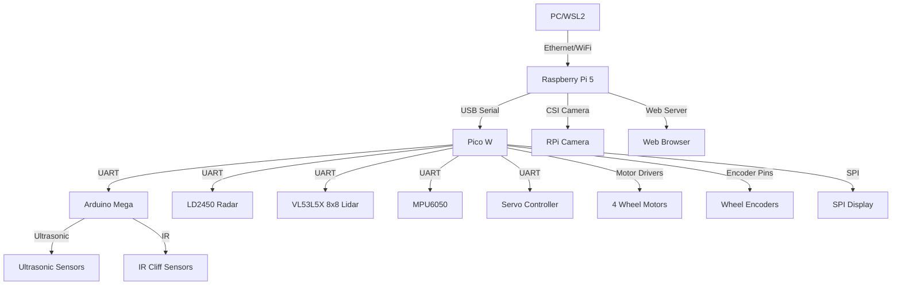

# System Architecture Diagram



# Software Architecture Diagram

```mermaid
flowchart TD
    subgraph ROS2_Nodes[ROS2 Nodes (Pi5/PC)]
        Vision[vision_node: Camera, Lidar, Radar Fusion, VLA]
        Navigation[navigation_node: Path Planning]
        Control[control_node: Serial Comms to Pico W]
        WebServer[web_server_node: Web Interface]
    end
    subgraph PicoW_Arduino[Pico W (Arduino IDE)]
        PicoWSensors[Sensor Reading]
        PicoWMotors[Motor Control]
        PicoWComms[UART/SPI Comms]
        PicoWSerial[Serial Bridge to Pi5]
    end
    subgraph Mega_Arduino[Arduino Mega]
        MegaSensors[Sensor Reading]
        MegaComms[UART to Pico W]
    end
    Vision -- Sensor Data --> Navigation
    Navigation -- Motor Commands --> Control
    Control -- Serial Data --> PicoWSerial
    PicoWSerial -- Sensor Data --> Control
    WebServer -- Commands --> Navigation
    WebServer -- Visualization --> Vision
```
