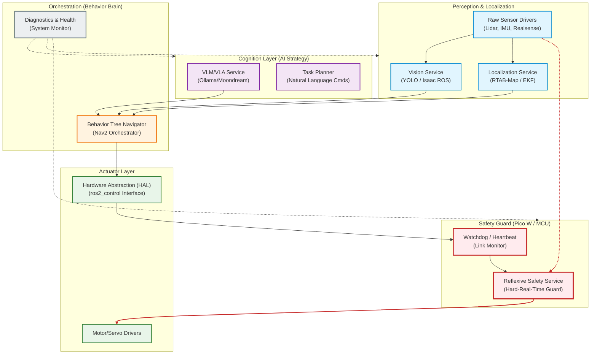

```mermaid
graph TD
    %% Define Styles
    classDef cognition fill:#f3e5f5,stroke:#7b1fa2,stroke-width:2px
    classDef perception fill:#e1f5fe,stroke:#0288d1,stroke-width:2px
    classDef orchestration fill:#fff3e0,stroke:#ef6c00,stroke-width:2px
    classDef safety fill:#ffebee,stroke:#c62828,stroke-width:3px
    classDef hardware fill:#e8f5e9,stroke:#2e7d32,stroke-width:2px
    classDef diag fill:#eceff1,stroke:#455a64,stroke-width:2px

    %% 1. Cognition Layer (The "Why")
    subgraph Cognition ["Cognition Layer (AI Strategy)"]
        VLM["VLM/VLA Service<br/>(Ollama/Moondream)"]:::cognition
        LLM["Task Planner<br/>(Natural Language Cmds)"]:::cognition
    end

    %% 2. Perception Layer (The "What")
    subgraph Perception ["Perception & Localization"]
        Vision["Vision Service<br/>(YOLO / Isaac ROS)"]:::perception
        SLAM["Localization Service<br/>(RTAB-Map / EKF)"]:::perception
        StaticSensors["Raw Sensor Drivers<br/>(Lidar, IMU, Realsense)"]:::perception
    end

    %% 3. Orchestration Layer (The "How")
    subgraph Orchestration ["Orchestration (Behavior Brain)"]
        BT["Behavior Tree Navigator<br/>(Nav2 Orchestrator)"]:::orchestration
        Diag["Diagnostics & Health<br/>(System Monitor)"]:::diag
    end

    %% 4. Safety Guard Layer (The "No")
    subgraph SafetyGuard ["Safety Guard (Pico W / MCU)"]
        SafetyNode["Reflexive Safety Service<br/>(Hard-Real-Time Guard)"]:::safety
        Heartbeat["Watchdog / Heartbeat<br/>(Link Monitor)"]:::safety
    end

    %% 5. Hardware/Actuator Layer
    subgraph Actuators ["Actuator Layer"]
        HAL["Hardware Abstraction (HAL)<br/>(ros2_control Interface)"]:::hardware
        Motors["Motor/Servo Drivers"]:::hardware
    end

    %% Data Flows
    StaticSensors --> Vision
    StaticSensors --> SLAM
    Vision --> BT
    SLAM --> BT
    VLM --> BT
    
    %% The Command Pipeline
    BT --> HAL
    HAL --> Heartbeat
    Heartbeat --> SafetyNode
    
    %% Direct Safety Loops (Critical)
    StaticSensors -.-> SafetyNode
    SafetyNode --> Motors

    %% Diagnostics Flow
    Diag -.-> Cognition
    Diag -.-> Perception
    Diag -.-> SafetyGuard

    %% Annotations for Safety Paths
    linkStyle 8 stroke:#c62828,stroke-width:2px
    linkStyle 9 stroke:#c62828,stroke-width:2px
```
