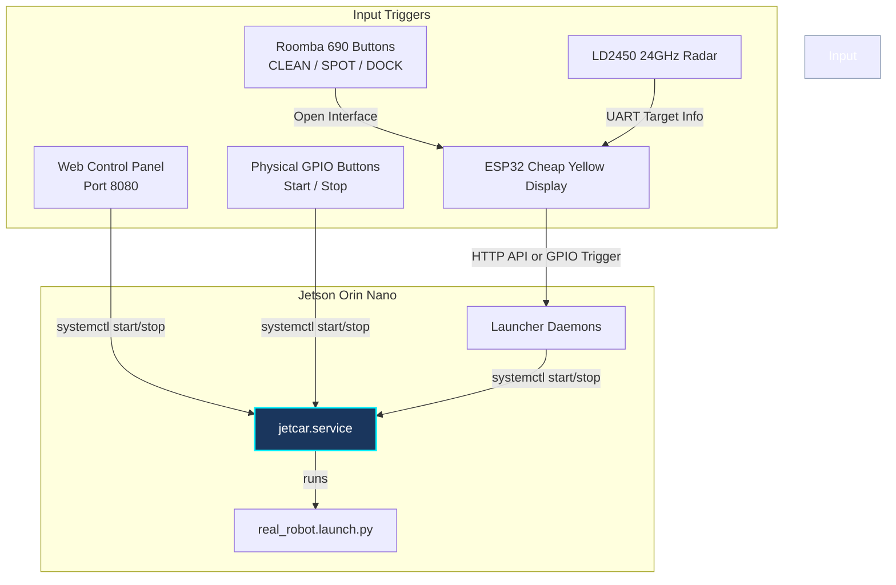
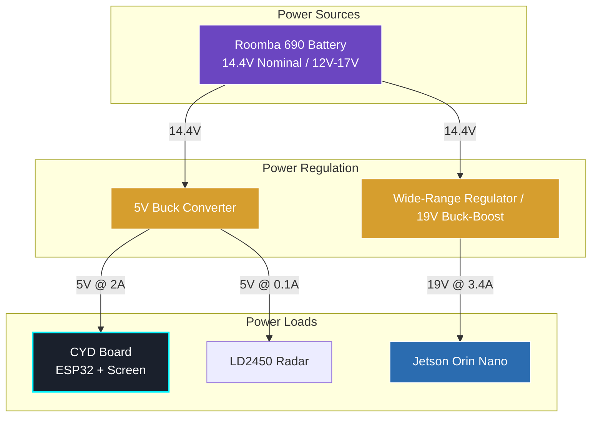

# Jetcar Remote Launching & Hardware Button Integration Guide

This guide details methods to start and stop your ROS2 stack on the Jetson Orin Nano without needing to SSH into the robot. This setup avoids launching ROS2 automatically on every boot, which is problematic for development.

---

## Architecture Overview

Instead of running launch commands directly, we configure **Systemd** on the Jetson to manage the ROS2 lifecycle. Both the Web Interface and the Physical Buttons/MCUs interact with Systemd.



---

## Critical Voltage & Logic Level Safety Rules

Before wiring any components, you must adhere to these safety rules to prevent destroying your Jetson Orin Nano or ESP32/CYD board.

> [!IMPORTANT]
> **What is a CYD?** The **Cheap Yellow Display (CYD)** (ESP32-2432S028R) is a **single integrated development board** containing an ESP32 chip, a 2.8" color TFT display (ILI9341 controller), and an XPT2046 touch controller on a single PCB. You do not need a separate ESP32 module—the CYD *is* the ESP32 with the display integrated.

| Interface / Pin | Native Voltage | Target Pin Voltage | Level Shifting Required? |
| :--- | :--- | :--- | :--- |
| **Jetson Orin Nano GPIOs** | 3.3V CMOS | 3.3V | **Yes (if source > 3.3V)**. Never expose Jetson pins to 5V. |
| **ESP32/CYD GPIOs** | 3.3V | 3.3V | **Yes (if source > 3.3V)**. ESP32 pins are not 5V-tolerant. |
| **Roomba OI TXD (Pin 7)** | **5V TTL** | ESP32 RX (3.3V) | **Yes!** Use a voltage divider (1kΩ and 2kΩ resistors) to scale 5V down to 3.3V. |
| **Roomba OI RXD (Pin 6)** | 5V (3.3V compatible) | ESP32 TX (3.3V) | **No.** Roomba detects 3.3V logic high safely. |
| **LD2450 Radar UART TX/RX**| 3.3V logic | ESP32 UART | **No.** LD2450 operates on 5V VCC but uses 3.3V UART levels. |
| **I2C Buses** | Varies | 3.3V | **Yes (if pull-ups are 5V)**. Always pull I2C lines to 3.3V. |

---

## Power Conversions & Distribution

To power the system safely and avoid brownouts, we must step down the voltages correctly.



### Power Specifications & Hardware Considerations

1. **Roomba Mini-DIN Power Limitations**:
   * The Roomba Mini-DIN 7-pin connector (pins 1 and 2, `Vpwr`) connects directly to the Roomba battery (~14.4V nominal).
   * **CAUTION**: The Roomba's internal power routing is protected by a resettable PTC fuse rated at around **1.0A - 1.5A**. Trying to power a Jetson Orin Nano directly from the Roomba's Mini-DIN port will trip the fuse and shut down the Roomba.
   * **Only power the CYD board and the LD2450 Radar** from the Roomba Mini-DIN port via a 5V buck converter.

2. **Jetson Orin Nano Power Requirements**:
   * The official Jetson Orin Nano Developer Kit carrier board requires **9V to 20V DC** (nominal **19V @ 3.42A**, up to 65W peak).
   * **Recommendation**: Power the Jetson Orin Nano from a dedicated main battery pack (e.g. 3S or 4S LiPo battery, or a high-capacity power bank supporting USB-C Power Delivery 20V) using a dedicated regulator.

3. **ESP32 CYD Board Power**:
   * The Cheap Yellow Display (CYD) board takes **5V input** via its USB port or the 5V power pin on its extension headers. It contains an onboard LDO regulator that drops the 5V input down to 3.3V for the ESP32 and display backlight.
   * The LD2450 Radar takes **5V input** (drawing ~80mA), which can share the same 5V regulator output feeding the CYD.

---

## Step 1: Creating the ROS2 Systemd Service

Systemd allows us to manage ROS2 as a background service, handle clean shutdown via signals (like `SIGINT` to mimic `Ctrl+C`), capture log outputs, and prevent port/node conflicts.

Create the file `/etc/systemd/system/jetcar.service` on the Jetson:

```ini
[Unit]
Description=Jetcar ROS2 Autonomous Robot Launch Service
After=network.target

[Service]
Type=simple
User=jeevan
WorkingDirectory=/home/jeevan/Jetcar
# Source ROS2 and workspace, then run launch file
ExecStart=/bin/bash -c "source /opt/ros/iron/setup.bash && source /home/jeevan/Jetcar/install/setup.bash && ros2 launch jetcar_bringup real_robot.launch.py"
# Send SIGINT (Ctrl+C) to allow clean ROS2 node destructors
KillSignal=SIGINT
Restart=no
StandardOutput=journal
StandardError=journal

[Install]
WantedBy=multi-user.target
```

Reload Systemd daemon to register the service:
```bash
sudo systemctl daemon-reload
```

You can now start, stop, and inspect the robot logs cleanly:
```bash
sudo systemctl start jetcar.service
sudo systemctl stop jetcar.service
journalctl -u jetcar.service -n 50 --no-pager
```

---

## Step 2: Web-Based Control Dashboard

A Flask web application running on port `8080` allows any device connected to the robot's local Wi-Fi to start/stop the ROS2 stack and view logs in real-time.

We have written the source files for this app in your workspace:
- **Flask App**: [app.py](file:///home/jeevan/Jetcar/scripts/web_launcher/app.py)
- **Web Template**: [index.html](file:///home/jeevan/Jetcar/scripts/web_launcher/templates/index.html)

### Allow Passwordless Control
To let the web app (running under user `jeevan`) execute systemctl commands without a password prompt, edit the sudoers file:
```bash
sudo visudo
```
Add the following line at the end:
```text
jeevan ALL=(ALL) NOPASSWD: /bin/systemctl start jetcar.service, /bin/systemctl stop jetcar.service, /bin/systemctl status jetcar.service, /bin/systemctl is-active jetcar.service
```

### Running the Web Server on Boot
To ensure the web server runs on boot, create `/etc/systemd/system/jetcar-web.service`:
```ini
[Unit]
Description=Jetcar Web Launch Controller
After=network.target

[Service]
Type=simple
User=jeevan
WorkingDirectory=/home/jeevan/Jetcar/scripts/web_launcher
ExecStart=/usr/bin/python3 app.py
Restart=always

[Install]
WantedBy=multi-user.target
```
Enable and start the web service:
```bash
sudo systemctl enable jetcar-web.service
sudo systemctl start jetcar-web.service
```

Access the panel from your phone/browser at: `http://<jetson-ip>:8080`

---

## Step 3: Physical Pushbuttons (GPIO-based) on Jetson Orin Nano

The Jetson Orin Nano Developer Kit features a 40-pin expansion header. All digital input/output pins on this header operate strictly at **3.3V**.

### 40-Pin Header Wiring Configuration:
1. **Start Button**: Connect between **Physical Pin 11** (GPIO 17 / GPIO3_PH.00) and **GND (Pin 9)**.
2. **Stop Button**: Connect between **Physical Pin 13** (GPIO 27 / GPIO3_PH.01) and **GND (Pin 14)**.
3. **Green LED (Running Indicator)**: Connect from **Physical Pin 15** -> 220Ω current-limiting resistor -> LED anode -> GND.
4. **Red LED (Stopped Indicator)**: Connect from **Physical Pin 16** -> 220Ω current-limiting resistor -> LED anode -> GND.

The control script is located at: [gpio_launcher.py](file:///home/jeevan/Jetcar/scripts/gpio_launcher.py).

To run this button daemon on boot, create a systemd service `/etc/systemd/system/jetcar-gpio.service`:
```ini
[Unit]
Description=Jetcar GPIO Button Launcher Daemon
After=network.target

[Service]
Type=simple
User=root
WorkingDirectory=/home/jeevan/Jetcar/scripts
ExecStart=/usr/bin/python3 gpio_launcher.py
Restart=always

[Install]
WantedBy=multi-user.target
```
Enable and start the service:
```bash
sudo systemctl enable jetcar-gpio.service
sudo systemctl start jetcar-gpio.service
```

---

## Step 4: iRobot Roomba 690 + ESP32 CYD + LD2450 Radar Integration

The **Cheap Yellow Display (CYD)** board (ESP32-2432S028R) integrates an ESP32 chip, a 2.8" color TFT display (ILI9341 over SPI), a touchscreen, and peripheral connectors. It acts as the local control terminal, reading Roomba buttons and radar inputs, updating the local screen, and triggering the Jetson.

### 1. Complete Schematic & Wiring
The CYD board exposes a few GPIO pins on its **CN1 (I2C)** and **Lora/IO (P2)** connectors:
* **CN1 (JST 1.0 4-pin)**: GND, 3.3V, GPIO 22, GPIO 21
* **P2/Lora (JST 1.0 4-pin)**: GND, 3.3V, GPIO 27, GPIO 35 (Note: GPIO 35 is **Input-Only**)

```text
Roomba Mini-DIN (7-Pin)          Level Shifter / Divider             CYD Board (ESP32)
+---------------------+           +--------------------+            +--------------------+
| Pin 1,2: Vpwr (14.4V)|--------->| VIN (Buck Converter|            |                    |
| Pin 3,4: GND        |-----*----->| GND  -> VOUT (5V)  |------*---->| USB Port / 5V Pin  |
|                     |     |     +--------------------+      |     |                    |
| Pin 7: TXD (5V TTL) |-----|---->[1kΩ Resistor]              |     |                    |
|                     |     |            |                    |     | Lora/P2 Port:      |
|                     |     |            *--------------------|---->| GPIO 35 (RX)       |
|                     |     |            |                    |     |                    |
|                     |     |       [2kΩ Resistor]            |     |                    |
|                     |     +------------*                    |     |                    |
| Pin 6: RXD (3.3V Ok)|<--------------------------------------|-----| GPIO 27 (TX)       |
| Pin 5: BRC (Wakeup) |<--------------------------------------|-----| GPIO 4 (RGB Green) |
+---------------------+                                       |     +--------------------+
                                                              |
LD2450 Radar (24GHz)                                          |     CN1 Port:
+---------------------+                                       |     +--------------------+
| Pin 1: VCC (5V)     |<--------------------------------------*---->| 5V / VCC           |
| Pin 2: GND          |<--------------------------------------------| GND                |
| Pin 3: TX (3.3V)    |-------------------------------------------->| GPIO 21 (Radar RX) |
| Pin 4: RX (3.3V)    |<--------------------------------------------| GPIO 22 (Radar TX) |
+---------------------+                                             +--------------------+
```

> [!WARNING]
> Roomba's TXD pin outputs 5V logic. You **MUST** use a voltage divider (1kΩ in series, 2kΩ to GND) to output a safe ~3.3V signal to the CYD's GPIO 35 RX pin.

---

### 2. ESP32 Arduino Firmware (CYD Display + Roomba + LD2450 Radar)
Install the **TFT_eSPI** library configured for the ESP32-2432S028R screen.

```cpp
#include <Arduino.h>
#include <TFT_eSPI.h> // Graphics and font library for ILI9341
#include <WiFi.h>
#include <HTTPClient.h>
#include <SoftwareSerial.h>

// Screen Initialization
TFT_eSPI tft = TFT_eSPI();

// Software Serial for Roomba 690 (Lora/P2 Connector)
// Pin 35 is RX-only on ESP32, which works perfectly for receiving Roomba TX
#define ROOMBA_RX_PIN 35
#define ROOMBA_TX_PIN 27
#define ROOMBA_BRC_PIN 4
SoftwareSerial RoombaSerial;

// Software Serial for LD2450 Radar (CN1 Connector)
#define RADAR_RX_PIN 21
#define RADAR_TX_PIN 22
SoftwareSerial RadarSerial;

// Jetson Trigger Config
const char* wifi_ssid = "Jetcar_Access_Point";
const char* wifi_password = "your_ap_password";
const String jetson_api_start = "http://192.168.1.1:8080/api/start";
const String jetson_api_stop = "http://192.168.1.1:8080/api/stop";

unsigned long last_query_time = 0;
bool robot_running = false;
String radar_status_text = "No Targets";

// Wake Roomba via BRC pin pulse
void wakeRoomba() {
  pinMode(ROOMBA_BRC_PIN, OUTPUT);
  digitalWrite(ROOMBA_BRC_PIN, HIGH);
  delay(100);
  digitalWrite(ROOMBA_BRC_PIN, LOW);
  delay(500); // 500ms low pulse wakes the Roomba SCI
  digitalWrite(ROOMBA_BRC_PIN, HIGH);
  delay(500);
}

void triggerJetson(bool start) {
  tft.fillRect(10, 100, 300, 40, TFT_BLUE);
  tft.setTextColor(TFT_WHITE);
  tft.drawString(start ? "STARTING ROS2..." : "STOPPING ROS2...", 20, 110, 4);

  if (WiFi.status() == WL_CONNECTED) {
    HTTPClient http;
    String url = start ? jetson_api_start : jetson_api_stop;
    http.begin(url);
    int httpResponseCode = http.POST("");
    http.end();
    robot_running = start;
  }
  delay(1000);
  drawUI();
}

void drawUI() {
  tft.fillScreen(TFT_BLACK);
  tft.setTextColor(TFT_CYAN);
  tft.drawString("JETCAR CONTROL PANEL", 20, 10, 4);
  tft.drawLine(10, 40, 310, 40, TFT_DARKGREY);

  // Draw ROS2 Status
  tft.drawString("ROS2 Status:", 20, 60, 2);
  if (robot_running) {
    tft.fillRect(140, 55, 100, 25, TFT_GREEN);
    tft.setTextColor(TFT_BLACK);
    tft.drawString(" RUNNING ", 150, 60, 2);
  } else {
    tft.fillRect(140, 55, 100, 25, TFT_RED);
    tft.setTextColor(TFT_WHITE);
    tft.drawString(" STOPPED ", 150, 60, 2);
  }

  // Draw Radar Info
  tft.setTextColor(TFT_CYAN);
  tft.drawString("Radar (LD2450):", 20, 160, 2);
  tft.setTextColor(TFT_YELLOW);
  tft.drawString(radar_status_text, 20, 190, 4);
  
  // Navigation Hints
  tft.setTextColor(TFT_WHITE);
  tft.drawString("Roomba SPOT+DOCK -> START | CLEAN -> STOP", 10, 220, 1);
}

// Parse LD2450 Radar Data Frame
void parseRadar() {
  // LD2450 frame structure: Header (0xAA 0xFF 0x03 0x00) ... Tail (0x55 0xCC)
  // Standard frame is 29 bytes long
  if (RadarSerial.available() >= 29) {
    if (RadarSerial.read() == 0xAA && RadarSerial.read() == 0xFF && 
        RadarSerial.read() == 0x03 && RadarSerial.read() == 0x00) {
      
      uint8_t buffer[25];
      RadarSerial.readBytes(buffer, 25);
      
      // Verify frame end signature (last two bytes of frame: 0x55 0xCC)
      if (buffer[23] == 0x55 && buffer[24] == 0xCC) {
        // Target 1 details
        int16_t t1_x = (buffer[1] << 8) | buffer[0];
        int16_t t1_y = (buffer[3] << 8) | buffer[2];
        int16_t t1_dist = sqrt(t1_x * t1_x + t1_y * t1_y);
        
        // Convert distance to string
        if (t1_dist > 50 && t1_dist < 6000) {
          radar_status_text = "Target: " + String(t1_dist) + " mm";
        } else {
          radar_status_text = "No Targets";
        }
      }
    }
  }
}

void setup() {
  // Init screen
  tft.init();
  tft.setRotation(1); // Landscape mode
  tft.fillScreen(TFT_BLACK);
  tft.drawString("Booting Controller...", 20, 100, 4);

  // Init Serials
  Serial.begin(115200);
  RoombaSerial.begin(115200, SWSERIAL_8N1, ROOMBA_RX_PIN, ROOMBA_TX_PIN);
  RadarSerial.begin(256000, SWSERIAL_8N1, RADAR_RX_PIN, RADAR_TX_PIN);
  
  wakeRoomba();
  RoombaSerial.write(128); // Start OI
  delay(50);
  RoombaSerial.write(131); // Safe Mode
  delay(50);

  // Wifi Connect
  WiFi.begin(wifi_ssid, wifi_password);
  int retry_count = 0;
  while (WiFi.status() != WL_CONNECTED && retry_count < 15) {
    delay(500);
    retry_count++;
  }

  drawUI();
}

void loop() {
  // 1. Process Radar Data
  parseRadar();

  // 2. Poll Roomba Buttons every 100ms
  if (millis() - last_query_time > 100) {
    last_query_time = millis();
    
    // Clear old buffer data
    while (RoombaSerial.available() > 0) RoombaSerial.read();
    
    RoombaSerial.write(142); // Query Sensors
    RoombaSerial.write(18);  // Packet 18 (Buttons)
    
    long timeout = millis();
    while (RoombaSerial.available() == 0 && (millis() - timeout < 50)) {
      delay(1);
    }
    
    if (RoombaSerial.available() > 0) {
      byte button_byte = RoombaSerial.read();
      bool clean = (button_byte & 0x01);
      bool spot  = (button_byte & 0x02);
      bool dock  = (button_byte & 0x04);
      
      if (spot && dock && !robot_running) {
        triggerJetson(true);  // Start ROS2
      } else if (clean && robot_running) {
        triggerJetson(false); // Stop ROS2
      }
    }
    
    // Refresh GUI values
    drawUI();
  }
}
```
