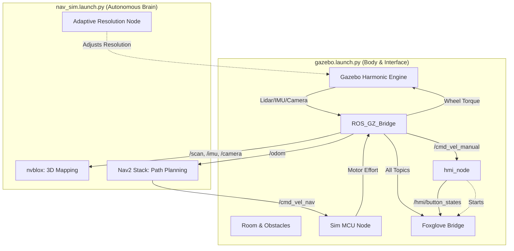

# Simulation Architecture Interaction

This diagram explains how `gazebo.launch.py` and `nav_sim.launch.py` interact within the Jetcar simulation environment.

## Key Interactions:
1.  **Infrastructure & Interface:** `gazebo.launch.py` handles the physical world, the robot body, and the user interface. It starts the **HMI Node**, which automatically launches the **Foxglove Bridge** for real-time visualization.
2.  **Sensor Data:** The Bridge translates raw Gazebo physics into standard ROS topics (`/scan`, `/imu`, `/camera/...`). These are used by both the HMI for display and the Brain for navigation.
3.  **The "Driver" (Sim MCU):** The `sim_mcu_node` acts as the motor controller. It listens for velocity commands from either the user (Manual) or Nav2 (Auto), calculates the required wheel torque, and sends it back to Gazebo.
4.  **Autonomous Brain:** `nav_sim.launch.py` provides the intelligence. **nvblox** builds a 3D map from camera data, and **Nav2** uses that map to plan paths and send movement commands (`cmd_vel_nav`) to the MCU.
5.  **Feedback Loop:** As the rover moves, its simulated position (`odom`) is bridged back to ROS, allowing Nav2 and nvblox to update the robot's location in the virtual room.
